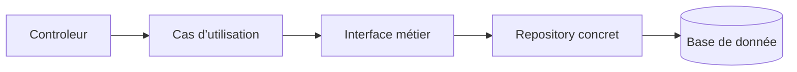

# Architecture logicielle

**L’architecture logicielle, c’est la manière dont une application est organisée : ses grandes parties, leurs responsabilités, et la façon dont elles communiquent entre elles.**

Elle sert à rendre le logiciel compréhensible, maintenable, testable et évolutif. En résumé : l’architecture logicielle est le plan de construction d’un logiciel.

## Introduction

### Objectif

L'objectif de l'architecture logicielle est de:

* **Naviguer** plus facilement dans le code
* **Maintenir** et **faire évoluer** plus facilement le code

Elle doit permettre de :

* Séparer les responsabilités (entre les classes, les concepts, etc)
* Réduire le couplage
* Homogénéiser
* Tester

### Complexité

On distingue généralement **deux grandes formes de complexité** en architecture logicielle :

* **La complexité essentielle** : C’est la complexité liée **au problème métier lui-même**
* **La complexité accidentelle** : C’est la complexité ajoutée par **nos choix techniques ou une mauvaise conception**

**La complexité esentielle** existe même avec une excellente architecture, car elle vient des règles du domaine.

> Exemples:
> * calculer une paie ;
> * gérer les droits d’accès ;
> * organiser un processus de recrutement ;
> * appliquer des règles de facturation ;
> * gérer des réservations, annulations et disponibilités.

On ne peut pas vraiment la supprimer. On peut surtout **la comprendre, la modéliser et l’isoler**, par exemple avec le DDD, des agrégats, des objets-valeur et des règles métier explicites.

La **complexité accidentelle** peut être réduite grâce à une bonne architecture, des conventions claires et des choix techniques adaptés.

> Exemples:
> * dépendances circulaires ;
> * logique métier mélangée aux contrôleurs ;
> * duplication de code ;
> * framework présent partout dans le domaine ;
> * trop de couches ou d’abstractions inutiles ;
> * architecture microservices alors qu’un monolithe suffirait ;
> * code difficile à tester à cause d’un fort couplage.

### L'architecture NTier

Pour tenter de répondre aux problématiques de la complexité, une première architecture a vu le jour: l'architecture **NTier**.

**L’architecture N-Tier consiste à découper une application en plusieurs couches techniques, chacune ayant une responsabilité précise.** L’objectif est de séparer les responsabilités afin de rendre l’application plus claire, maintenable et évolutive.

> Exemple classique :
> * **Présentation** : interface utilisateur, contrôleurs, API ;
> * **Métier** : règles et logique de l’application ;
> * **Accès aux données** : communication avec la base de données ;
> * éventuellement d’autres couches : sécurité, services externes, infrastructure.

_Le mot **N-Tier** signifie simplement qu’il peut y avoir **N couches**, donc autant que nécessaire._

Attention : dans une architecture N-Tier, les couches sont souvent aussi séparées physiquement, par exemple sur plusieurs serveurs ou services.


#### Les problèmes du NTier

Les principaux problèmes de l’architecture **N-Tier** sont les suivants :

* **Fort couplage entre les couches** : une modification dans une couche peut entraîner des changements dans plusieurs autres.
* **Dépendance à la base de données** : la logique métier finit souvent par être construite autour du modèle de données.
* **Logique métier dispersée** : certaines règles se retrouvent dans les contrôleurs, les services ou les repositories.
* **Beaucoup de code intermédiaire** : DTO, services, mappers et repositories peuvent ajouter du code sans réelle valeur.
* **Tests métier plus difficiles** : si le métier dépend directement de la base de données ou du framework.
* **Évolution plus coûteuse** : avec le temps, les couches peuvent devenir volumineuses et difficiles à modifier.
* **Risque de “couche service fourre-tout”** : toute la logique est placée dans de gros services peu cohérents.
* **Architecture parfois trop rigide** : même une petite fonctionnalité doit traverser toutes les couches.

**Le principal défaut du N-Tier est qu’il sépare bien les aspects techniques, mais pas toujours les concepts métier.
**

Cette architecture reste adaptée à des applications simples, mais elle devient souvent moins efficace lorsque le domaine métier est complexe.

#### L'inversion de dépendance

La principale solution aux limites du N-Tier classique consiste à appliquer **l’inversion de dépendance**.

Dans un N-Tier classique, la logique métier dépend souvent directement de l’infrastructure. Le problème est que le métier devient dépendant de détails techniques comme PostgreSQL, Prisma, une API externe ou un framework.

Avec l’inversion de dépendance, on retourne cette relation :



Le métier ne dépend plus directement de la base de données. Il définit seulement ce dont il a besoin à travers une interface.

Exemple :

```ts
interface UserRepository {
  findById(id: string): Promise<User | null>;
}
```

Le cas d’utilisation dépend de cette interface :

```ts
class GetUser {
  constructor(private readonly users: UserRepository) {}

  execute(id: string) {
    return this.users.findById(id);
  }
}
```

Puis l’infrastructure fournit une implémentation concrète :

```ts
class PrismaUserRepository implements UserRepository {
  async findById(id: string) {
    return prisma.user.findUnique({
      where: { id },
    });
  }
}
```

Ainsi, le métier connaît seulement `UserRepository`. Il ne connaît ni Prisma, ni PostgreSQL.

> L’inversion de dépendance consiste à faire dépendre les détails techniques du métier, plutôt que de faire dépendre le métier des détails techniques.

Cela permet de rendre le code :

* plus testable ;
* moins couplé ;
* plus facile à faire évoluer ;
* indépendant du framework et de la base de données.

C’est l’un des principes centraux des architectures hexagonale, Clean Architecture et Onion Architecture.


