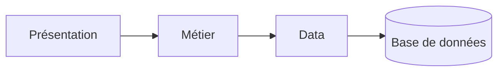
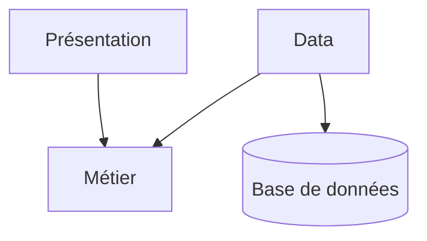
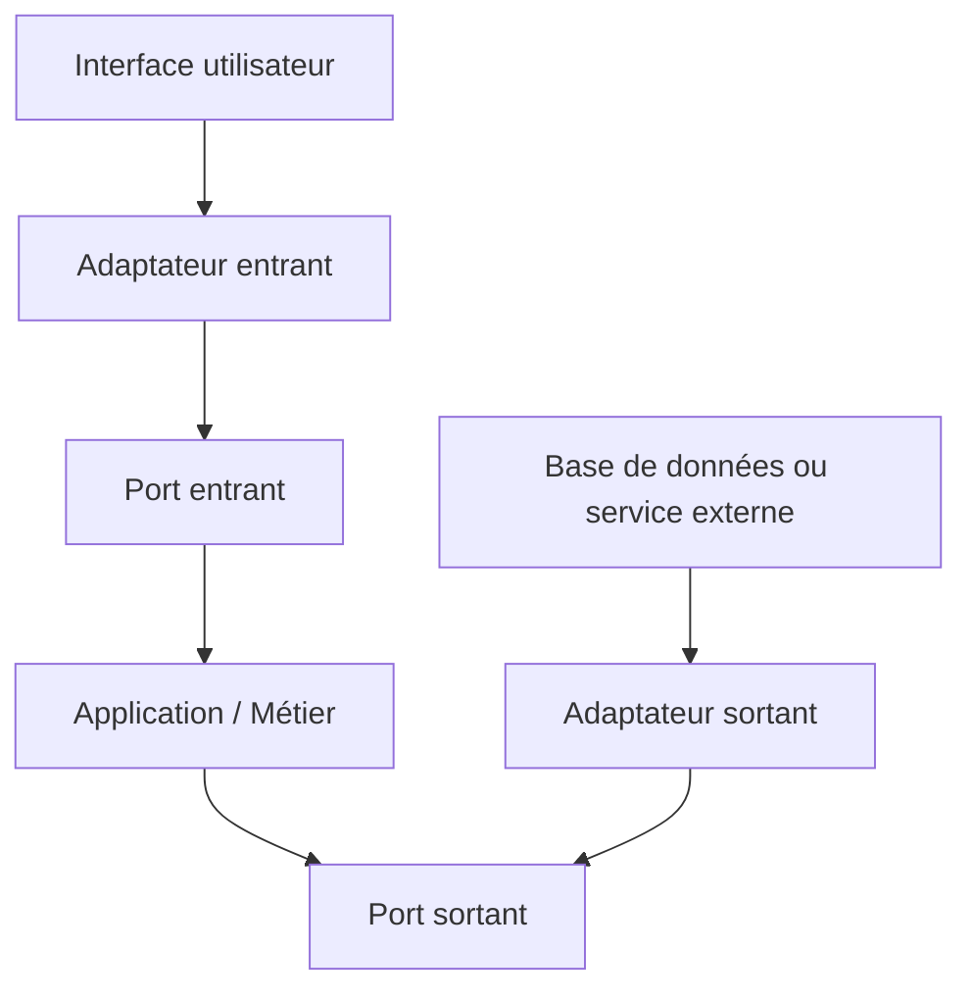
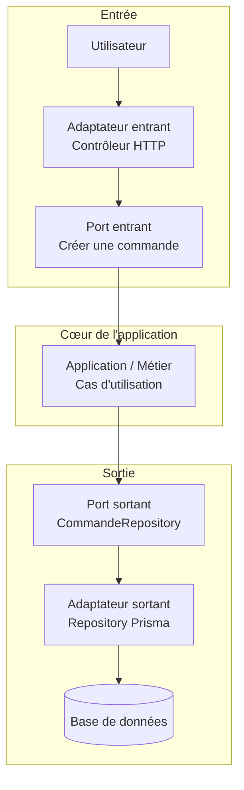

# Architecture logicielle

**L’architecture logicielle, c’est la manière dont une application est organisée : ses grandes parties, leurs responsabilités, et la façon dont elles communiquent entre elles.**

Elle sert à rendre le logiciel compréhensible, maintenable, testable et évolutif. En résumé : l’architecture logicielle est le plan de construction d’un logiciel.

## Introduction

### Objectif

L'objectif de l'architecture logicielle est de:

* **Naviguer** plus facilement dans le code
* **Maintenir** et **faire évoluer** plus facilement le code

Elle doit permettre de :

* Séparer les responsabilités (entre les classes, les concepts, etc)
* Réduire le couplage
* Homogénéiser
* Tester

### Complexité

On distingue généralement **deux grandes formes de complexité** en architecture logicielle :

* **La complexité essentielle** : C’est la complexité liée **au problème métier lui-même**
* **La complexité accidentelle** : C’est la complexité ajoutée par **nos choix techniques ou une mauvaise conception**

**La complexité esentielle** existe même avec une excellente architecture, car elle vient des règles du domaine.

> Exemples:
> * calculer une paie ;
> * gérer les droits d’accès ;
> * organiser un processus de recrutement ;
> * appliquer des règles de facturation ;
> * gérer des réservations, annulations et disponibilités.

On ne peut pas vraiment la supprimer. On peut surtout **la comprendre, la modéliser et l’isoler**, par exemple avec le DDD, des agrégats, des objets-valeur et des règles métier explicites.

La **complexité accidentelle** peut être réduite grâce à une bonne architecture, des conventions claires et des choix techniques adaptés.

> Exemples:
> * dépendances circulaires ;
> * logique métier mélangée aux contrôleurs ;
> * duplication de code ;
> * framework présent partout dans le domaine ;
> * trop de couches ou d’abstractions inutiles ;
> * architecture microservices alors qu’un monolithe suffirait ;
> * code difficile à tester à cause d’un fort couplage.

### L'architecture NTier

Pour tenter de répondre aux problématiques de la complexité, une première architecture a vu le jour: l'architecture **NTier**.

**L’architecture N-Tier consiste à découper une application en plusieurs couches techniques, chacune ayant une responsabilité précise.** L’objectif est de séparer les responsabilités afin de rendre l’application plus claire, maintenable et évolutive.

> Exemple classique :
> * **Présentation** : interface utilisateur, contrôleurs, API ;
> * **Métier** : règles et logique de l’application ;
> * **Data** : communication avec la base de données ;
> * éventuellement d’autres couches : sécurité, services externes, infrastructure.

_Le mot **N-Tier** signifie simplement qu’il peut y avoir **N couches**, donc autant que nécessaire._

Attention : dans une architecture N-Tier, les couches sont souvent aussi séparées physiquement, par exemple sur plusieurs serveurs ou services.



#### Les problèmes du NTier

Les principaux problèmes de l’architecture **N-Tier** sont les suivants :

* **Fort couplage entre les couches** : une modification dans une couche peut entraîner des changements dans plusieurs autres.
* **Dépendance à la base de données** : la logique métier finit souvent par être construite autour du modèle de données.
* **Logique métier dispersée** : certaines règles se retrouvent dans les contrôleurs, les services ou les repositories.
* **Beaucoup de code intermédiaire** : DTO, services, mappers et repositories peuvent ajouter du code sans réelle valeur.
* **Tests métier plus difficiles** : si le métier dépend directement de la base de données ou du framework.
* **Évolution plus coûteuse** : avec le temps, les couches peuvent devenir volumineuses et difficiles à modifier.
* **Risque de “couche service fourre-tout”** : toute la logique est placée dans de gros services peu cohérents.
* **Architecture parfois trop rigide** : même une petite fonctionnalité doit traverser toutes les couches.

**Le principal défaut du N-Tier est qu’il sépare bien les aspects techniques, mais pas toujours les concepts métier.**

Cette architecture reste adaptée à des applications simples, mais elle devient souvent moins efficace lorsque le domaine métier est complexe.

#### L'inversion de dépendance

La principale solution aux limites du N-Tier classique consiste à appliquer **l’inversion de dépendance**.
Dans un N-Tier classique, la logique métier dépend souvent directement de l’infrastructure. Le problème est que le métier devient dépendant de détails techniques comme PostgreSQL, Prisma, une API externe ou un framework.

**L’inversion de dépendance consiste à faire dépendre la logique métier d’**interfaces abstraites**, plutôt que de technologies concrètes comme une base de données ou un framework. Les détails techniques viennent ensuite implémenter ces interfaces.**

Avec l’inversion de dépendance, on retourne cette relation :



Le métier ne dépend plus directement de la base de données. Il définit seulement ce dont il a besoin à travers une interface.

Exemple :

```ts
interface UserRepository {
  findById(id: string): Promise<User | null>;
}

class GetUser {
  constructor(private readonly users: UserRepository) {}

  execute(id: string) {
    return this.users.findById(id);
  }
}
```

_Puis l’infrastructure fournit une implémentation concrète :_

```ts
class PrismaUserRepository implements UserRepository {
  async findById(id: string) {
    return prisma.user.findUnique({
      where: { id },
    });
  }
}
```

C’est l’un des principes centraux des architectures hexagonale, Clean Architecture et Onion Architecture.


---

## L'architecture Hexagonale - Ports and adapters architecture

**L’architecture hexagonale, aussi appelée Ports and Adapters Architecture, a pour objectif principal de placer la logique métier au centre de l’application et de la protéger des dépendances techniques.**

### Objectifs

* **Se protéger de l'infiltration (leaking)**
* **Isoler le code métier de la technique (UI et data)**
* **Construire l'application avant les problématiques techniques**
* **Un seul layer: l'application**

#### L'infiltration technique (ou leaking)

L’un des risques fréquents dans une application est de laisser les détails techniques s’infiltrer dans le code métier.
Cette **infiltration**, parfois appelée **leaking**, rend le métier difficile à comprendre, à tester et à faire évoluer.

> Par exemple, le domaine ne devrait pas dépendre directement :
> * d’un framework comme NestJS ou Spring ;
> * d’un ORM comme Prisma ou Hibernate ;
> * d’une base de données particulière ;
> * d’une interface HTTP ;
> * d’un service externe.

#### Isoler le code métier

**Le code métier constitue le cœur de l’application. Il contient les règles, les cas d’utilisation et les comportements propres au domaine.**

Les éléments techniques, comme l’interface utilisateur, la base de données ou les API externes, sont placés autour de ce cœur.

> Le métier ne connaît donc pas directement :
>
> * l’interface graphique ;
> * les contrôleurs HTTP ;
> * la base de données ;
> * les bibliothèques techniques ;
> * les services tiers.

Il communique avec l’extérieur à travers des **ports**, c’est-à-dire des interfaces définissant les échanges autorisés.

Les technologies concrètes viennent ensuite se connecter à ces ports grâce à des **adaptateurs**.

#### Construire l’application avant les problématiques techniques

**L’architecture hexagonale encourage à commencer par les besoins métier, avant de choisir les technologies.**

On peut ainsi développer et tester les cas d’utilisation sans avoir encore décidé :

* quelle base de données utiliser ;
* quel framework web choisir ;
* si l’application aura une interface web, mobile ou en ligne de commande ;
* quel service externe sera utilisé.

> Par exemple, on peut écrire un cas d’utilisation CréerUneCommande avant de choisir PostgreSQL, Prisma ou NestJS.

Cela évite de construire l’application autour d’un framework ou d’une base de données. La technologie devient un détail remplaçable et non le centre de la conception.

#### Un seul coeur: l'application

**Dans l’architecture hexagonale, on ne raisonne pas principalement en couches techniques comme dans une architecture N-Tier.**

On distingue surtout **deux espaces** :
* l’**intérieur**, qui contient l’application et le métier
* l’**extérieur**, qui contient les technologies et les systèmes externes

Le cœur de l’application contient notamment :

* les entités métier
* les objets-valeur
* les règles métier
* les cas d’utilisation
* les ports

Autour de ce cœur se trouvent les adaptateurs :

* contrôleurs HTTP
* interface utilisateur
* repository SQL
* client d’API
* système de messagerie
* stockage de fichiers

Les dépendances doivent toujours être orientées vers le cœur de l’application.



**L’application définit donc ce dont elle a besoin, tandis que les technologies externes viennent s’adapter à elle.**

### Les ports

**Les ports sont les interfaces qui définissent comment le cœur de l’application peut être utilisé ou communiquer avec l’extérieur.**

On distingue:
* les **driving ports**
* les **driven ports**.

**Les driving ports sont les portes d'entrée** de l'application, qui permettent de demander un service à l'application:

* pour configurer
* pour utiliser
* pour administrer

**Les driven ports sont les ports qui indiquent à l'extérieur ce dont l'application à besoin pour fonctionner**:

* pour obtenir des données
* pour notifier des systèmes
* pour contrôler d'autres éléments

> Dans les langages sypés les ports sont souvent représentés par des **interfaces**.

### Les adapters

**Les adapters sont des implémentations techniques qui relient les ports à des technologies concrètes comme une API, une base de données ou une interface utilisateur.**

On distingue:
* les **driving adapters** qui utilisent les driving ports pour piloter l'application
* les **driven ports** qui vont implémenter ce dont l'application a besoin

Exemple :




