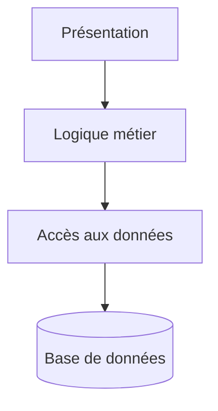

# Architecture logicielle

**L’architecture logicielle, c’est la manière dont une application est organisée : ses grandes parties, leurs responsabilités, et la façon dont elles communiquent entre elles.**

Elle sert à rendre le logiciel compréhensible, maintenable, testable et évolutif. En résumé : l’architecture logicielle est le plan de construction d’un logiciel.

## Introduction

### Objectif

L'objectif de l'architecture logicielle est de:

* **Naviguer** plus facilement dans le code
* **Maintenir** et **faire évoluer** plus facilement le code

Elle doit permettre de :

* Séparer les responsabilités (entre les classes, les concepts, etc)
* Réduire le couplage
* Homogénéiser
* Tester

### Complexité

On distingue généralement **deux grandes formes de complexité** en architecture logicielle :

* **La complexité essentielle** : C’est la complexité liée **au problème métier lui-même**
* **La complexité accidentelle** : C’est la complexité ajoutée par **nos choix techniques ou une mauvaise conception**

**La complexité esentielle** existe même avec une excellente architecture, car elle vient des règles du domaine.

> Exemples:
> * calculer une paie ;
> * gérer les droits d’accès ;
> * organiser un processus de recrutement ;
> * appliquer des règles de facturation ;
> * gérer des réservations, annulations et disponibilités.

On ne peut pas vraiment la supprimer. On peut surtout **la comprendre, la modéliser et l’isoler**, par exemple avec le DDD, des agrégats, des objets-valeur et des règles métier explicites.

La **complexité accidentelle** peut être réduite grâce à une bonne architecture, des conventions claires et des choix techniques adaptés.

> Exemples:
> * dépendances circulaires ;
> * logique métier mélangée aux contrôleurs ;
> * duplication de code ;
> * framework présent partout dans le domaine ;
> * trop de couches ou d’abstractions inutiles ;
> * architecture microservices alors qu’un monolithe suffirait ;
> * code difficile à tester à cause d’un fort couplage.

### L'architecture NTier

Pour tenter de répondre aux problématiques de la complexité, une première architecture a vu le jour: l'architecture **NTier**.

**L’architecture N-Tier consiste à découper une application en plusieurs couches techniques, chacune ayant une responsabilité précise.** L’objectif est de séparer les responsabilités afin de rendre l’application plus claire, maintenable et évolutive.

> Exemple classique :
> * **Présentation** : interface utilisateur, contrôleurs, API ;
> * **Métier** : règles et logique de l’application ;
> * **Accès aux données** : communication avec la base de données ;
> * éventuellement d’autres couches : sécurité, services externes, infrastructure.

_Le mot **N-Tier** signifie simplement qu’il peut y avoir **N couches**, donc autant que nécessaire._

Attention : dans une architecture N-Tier, les couches sont souvent aussi séparées physiquement, par exemple sur plusieurs serveurs ou services.

