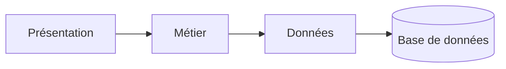
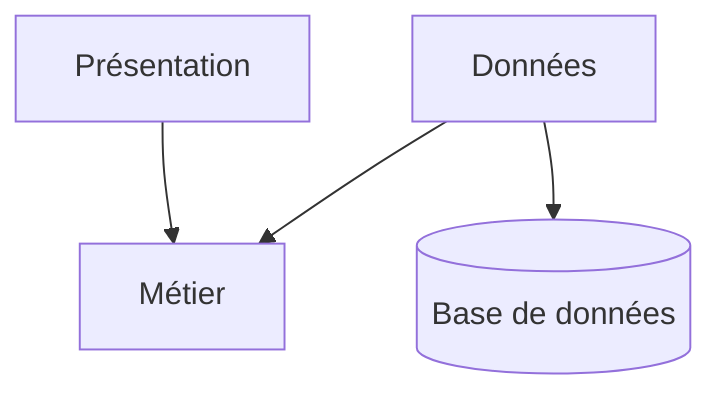
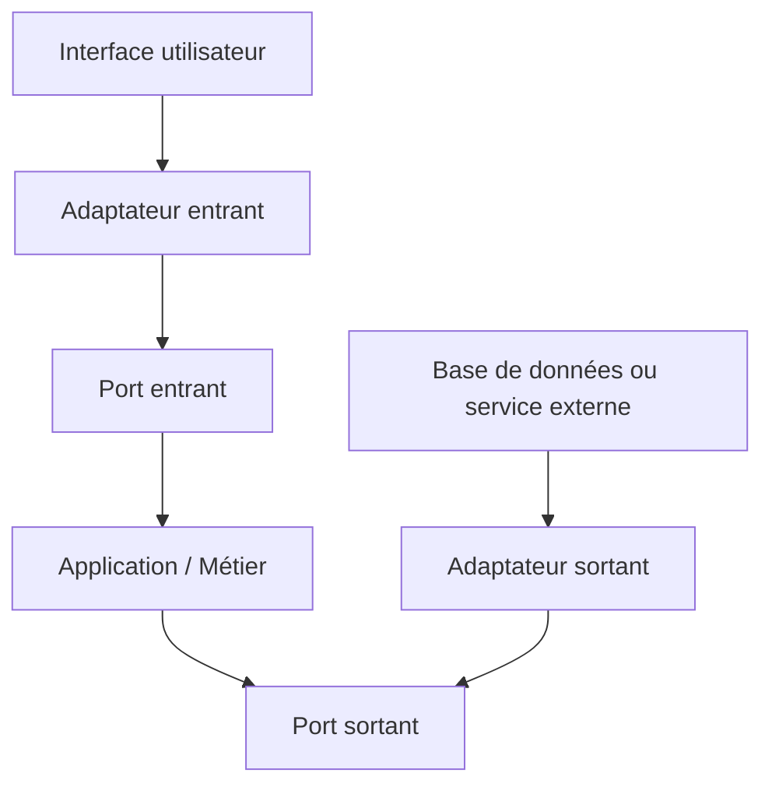
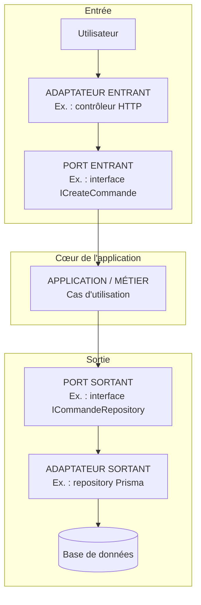
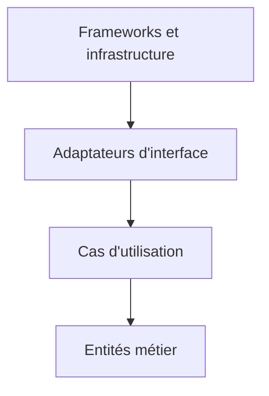
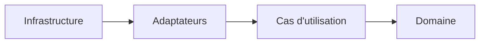
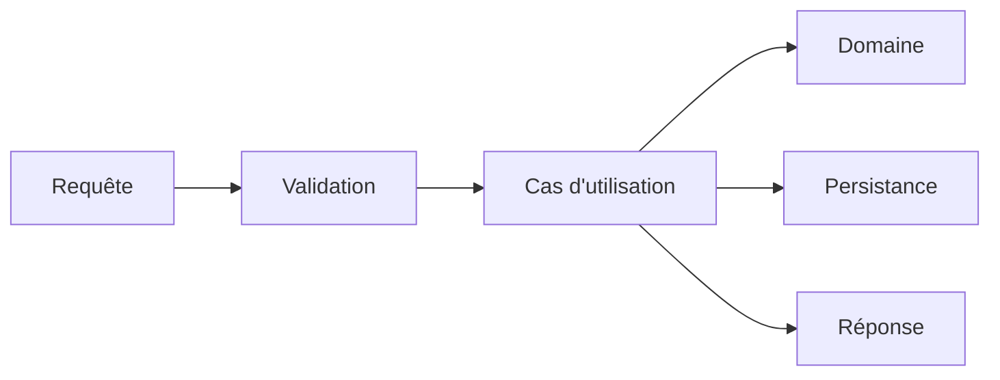

# Architecture logicielle

_Avant de lire cet article, lisez d'abord l'article sur le [Domain Driven Design](/DDD.md) qui présente plusieurs notions de bases qui vous seront utiles pour bien comprendre ce qui suit._

**L’architecture logicielle, c’est la manière dont une application est organisée : ses grandes parties, leurs responsabilités et la façon dont elles communiquent entre elles.**

Elle sert à rendre le logiciel compréhensible, maintenable, testable et évolutif. En résumé, l’architecture logicielle est le plan de construction d’un logiciel.

## Introduction

### Objectifs

L’objectif de l’architecture logicielle est de :

* **naviguer** plus facilement dans le code ;
* **maintenir** et **faire évoluer** plus facilement le code.

Elle doit notamment permettre de :

* séparer les responsabilités entre les classes, les concepts et les modules ;
* réduire le couplage ;
* homogénéiser l’organisation du code ;
* faciliter les tests.

### Complexité

On distingue généralement **deux grandes formes de complexité** en architecture logicielle :

* **la complexité essentielle** : c’est la complexité liée **au problème métier lui-même** ;
* **la complexité accidentelle** : c’est la complexité ajoutée par **nos choix techniques ou par une mauvaise conception**.

**La complexité essentielle** existe même avec une excellente architecture, car elle vient des règles du domaine.

> Exemples :
>
> * calculer une paie ;
> * gérer les droits d’accès ;
> * organiser un processus de recrutement ;
> * appliquer des règles de facturation ;
> * gérer des réservations, des annulations et des disponibilités.

On ne peut pas vraiment la supprimer. On peut surtout **la comprendre, la modéliser et l’isoler**, par exemple avec le DDD, des agrégats, des objets-valeur et des règles métier explicites.

La **complexité accidentelle** peut, quant à elle, être réduite grâce à une bonne architecture, des conventions claires et des choix techniques adaptés.

> Exemples :
>
> * dépendances circulaires ;
> * logique métier mélangée aux contrôleurs ;
> * duplication de code ;
> * framework présent partout dans le domaine ;
> * trop de couches ou d’abstractions inutiles ;
> * architecture microservices alors qu’un monolithe suffirait ;
> * code difficile à tester à cause d’un fort couplage.

## L’architecture en couches

Une manière classique d’organiser une application consiste à la découper en plusieurs **couches logiques**, chacune ayant une responsabilité précise. On parle alors d’architecture en couches, ou **N-Layer Architecture**.

> Exemple classique :
>
> * **présentation** : interface utilisateur, contrôleurs, API ;
> * **métier** : règles et logique de l’application ;
> * **données** : communication avec la base de données ;
> * éventuellement d’autres couches : sécurité, services externes, infrastructure.

Le mot **N-Layer** signifie simplement qu’il peut y avoir **N couches**, donc autant que nécessaire.



### Différence entre N-Layer et N-Tier

Les termes **layer** et **tier** sont souvent confondus, mais ils ne désignent pas exactement la même chose.

* Une **layer** est une séparation logique dans le code.
* Un **tier** est une séparation physique ou déployable.

Une application peut donc comporter plusieurs couches logiques tout en étant déployée dans un seul processus.

À l’inverse, une architecture **N-Tier** peut répartir l’application sur plusieurs machines ou services :

* un client ou navigateur ;
* un serveur applicatif ;
* un serveur de base de données.

Dans le langage courant, on utilise parfois le terme N-Tier pour parler d’une architecture en couches, mais **N-Layer** est plus précis lorsqu’on parle uniquement de l’organisation du code.

### Les limites fréquentes de l’architecture en couches

Une architecture en couches n’entraîne pas nécessairement les problèmes suivants. Cependant, elle y conduit fréquemment lorsqu’elle est organisée autour de la base de données et que toutes les dépendances vont de haut en bas.

Les dérives les plus courantes sont les suivantes :

* **Fort couplage entre les couches** : une modification dans une couche peut entraîner des changements dans plusieurs autres.
* **Dépendance à la base de données** : la logique métier finit souvent par être construite autour du modèle de données.
* **Logique métier dispersée** : certaines règles se retrouvent dans les contrôleurs, les services ou les composants d’accès aux données.
* **Beaucoup de code intermédiaire** : DTO, services, mappers et repositories peuvent ajouter du code sans réelle valeur.
* **Tests métier plus difficiles** : le métier peut devenir difficile à tester s’il dépend directement de la base de données ou du framework.
* **Évolution plus coûteuse** : avec le temps, les couches peuvent devenir volumineuses et difficiles à modifier.
* **Risque de couche service fourre-tout** : toute la logique est placée dans de gros services peu cohérents.
* **Architecture parfois trop rigide** : même une petite fonctionnalité doit traverser toutes les couches.

**Le principal risque de l’architecture en couches classique est qu’elle sépare correctement les aspects techniques, mais pas toujours les concepts métier.**

Cette architecture reste adaptée à de nombreuses applications simples. Elle devient toutefois plus difficile à faire évoluer lorsque le domaine métier est complexe ou lorsque la logique métier dépend trop fortement des détails techniques.

### L’inversion de dépendance

Une des principales solutions aux limites de l’architecture en couches classique consiste à appliquer **l’inversion de dépendance**.

Dans une architecture en couches traditionnelle, la logique métier dépend souvent directement de l’infrastructure. Le métier devient alors dépendant de détails techniques comme PostgreSQL, Prisma, une API externe ou un framework.

**L’inversion de dépendance consiste à faire dépendre la logique métier d’interfaces abstraites plutôt que de technologies concrètes comme une base de données ou un framework. Les détails techniques viennent ensuite implémenter ces interfaces.**

Avec l’inversion de dépendance, on retourne la relation entre le métier et l’infrastructure :



Le métier ne dépend plus directement de la base de données. Il définit seulement ce dont il a besoin à travers une interface.

Exemple :

```ts
interface UserRepository {
  findById(id: string): Promise<User | null>;
}

class GetUser {
  constructor(private readonly users: UserRepository) {}

  execute(id: string): Promise<User | null> {
    return this.users.findById(id);
  }
}
```

Puis l’infrastructure fournit une implémentation concrète :

```ts
class PrismaUserRepository implements UserRepository {
  async findById(id: string): Promise<User | null> {
    return prisma.user.findUnique({
      where: { id },
    });
  }
}
```

C’est l’un des principes centraux de l’architecture hexagonale, de la Clean Architecture et de l’Onion Architecture.

---

## L’architecture hexagonale — Ports and Adapters Architecture

**L’architecture hexagonale, aussi appelée Ports and Adapters Architecture, a pour objectif principal de placer la logique métier au centre de l’application et de la protéger des dépendances techniques.**

### Objectifs

* **Se protéger de l’infiltration technique**
* **Isoler le code métier de la technique**
* **Concevoir l’application à partir des besoins métier**
* **Construire un cœur applicatif entouré d’adaptateurs**

### L’infiltration technique

L’un des risques fréquents dans une application est de laisser les détails techniques s’infiltrer dans le code métier.

Cette **infiltration technique**, parfois appelée **leaking**, rend le métier plus difficile à comprendre, à tester et à faire évoluer.

> Par exemple, le domaine ne devrait pas dépendre directement :
>
> * d’un framework comme NestJS ou Spring ;
> * d’un ORM comme Prisma ou Hibernate ;
> * d’une base de données particulière ;
> * d’une interface HTTP ;
> * d’un service externe.

### Isoler le code métier

**Le code métier constitue le cœur de l’application. Il contient les règles, les cas d’utilisation et les comportements propres au domaine.**

Les éléments techniques, comme l’interface utilisateur, la base de données ou les API externes, sont placés autour de ce cœur.

> Le métier ne connaît donc pas directement :
>
> * l’interface graphique ;
> * les contrôleurs HTTP ;
> * la base de données ;
> * les bibliothèques techniques ;
> * les services tiers.

Il communique avec l’extérieur à travers des **ports**, qui définissent les échanges autorisés.

Les technologies concrètes viennent ensuite se connecter à ces ports grâce à des **adaptateurs**.

### Concevoir l’application avant les détails techniques

**L’architecture hexagonale encourage à commencer par les besoins métier avant de choisir les technologies.**

On peut ainsi développer et tester les cas d’utilisation sans avoir encore décidé :

* quelle base de données utiliser ;
* quel framework web choisir ;
* si l’application aura une interface web, mobile ou en ligne de commande ;
* quel service externe sera utilisé.

> Par exemple, on peut écrire un cas d’utilisation `CréerUneCommande` avant de choisir PostgreSQL, Prisma ou NestJS.

Cela évite de construire l’application autour d’un framework ou d’une base de données. La technologie devient un détail remplaçable et non le centre de la conception.

### Un cœur applicatif entouré d’adaptateurs

**Dans l’architecture hexagonale, on ne raisonne pas principalement en couches techniques comme dans une architecture en couches traditionnelle.**

On distingue surtout **deux espaces** :

* l’**intérieur**, qui contient l’application et le métier ;
* l’**extérieur**, qui contient les technologies et les systèmes externes.

Le cœur de l’application peut notamment contenir :

* les entités métier ;
* les objets-valeur ;
* les règles métier ;
* les cas d’utilisation ;
* les ports.

Autour de ce cœur se trouvent les adaptateurs :

* contrôleurs HTTP ;
* interfaces utilisateur ;
* adaptateurs de persistance SQL ;
* clients d’API ;
* systèmes de messagerie ;
* stockage de fichiers.

Les dépendances du code doivent être orientées vers le cœur de l’application.



**L’application définit donc ce dont elle a besoin, tandis que les technologies externes viennent s’adapter à elle.**

> Attention : le sens des appels à l’exécution et le sens des dépendances dans le code ne sont pas toujours identiques.
>
> À l’exécution, le cas d’utilisation appelle par exemple un repository. Dans le code, il dépend uniquement d’un port. L’adaptateur concret dépend lui aussi de ce port pour l’implémenter.

### Les ports

**Les ports représentent les points d’entrée et de sortie du cœur applicatif. Ils définissent comment l’application peut être utilisée et comment elle peut communiquer avec l’extérieur.**

Ils peuvent être matérialisés par des interfaces, mais aussi directement par l’API publique des cas d’utilisation.

On distingue :

* les **driving ports**, ou ports entrants ;
* les **driven ports**, ou ports sortants.

#### Les ports entrants

**Les driving ports sont les portes d’entrée de l’application.** Ils permettent à un élément extérieur de demander un service à l’application.

Ils peuvent servir, par exemple, à :

* utiliser une fonctionnalité ;
* administrer l’application ;
* déclencher une opération ;
* consulter une information.

Dans un langage typé, ils peuvent être représentés par des interfaces, mais ce n’est pas obligatoire. Une classe de cas d’utilisation peut elle-même jouer le rôle de port entrant.

#### Les ports sortants

**Les driven ports décrivent ce dont l’application a besoin pour fonctionner.**

Ils peuvent servir, par exemple, à :

* obtenir ou enregistrer des données ;
* notifier un système externe ;
* envoyer un message ;
* appeler un service tiers ;
* stocker un fichier.

Dans les langages typés, ces ports sont souvent représentés par des **interfaces** définies dans le cœur applicatif.

### Les adaptateurs

**Les adaptateurs sont des implémentations techniques qui relient les ports à des technologies concrètes comme une API, une base de données ou une interface utilisateur.**

On distingue :

* les **driving adapters**, ou adaptateurs entrants, qui utilisent les ports entrants pour piloter l’application ;
* les **driven adapters**, ou adaptateurs sortants, qui implémentent les ports sortants définis par l’application.

### Schéma avec ports et adaptateurs

**Le cœur de l’application définit les ports ; les adaptateurs techniques utilisent ou implémentent ces ports.**



Les adaptateurs peuvent facilement être remplacés par des **fakes**, des **stubs** ou des **mocks**, ce qui permet de tester l’application indépendamment de la base de données, du framework ou des services externes.

## Exemple de structure en architecture hexagonale

```text
src/
│
├── modules/
│   │
│   ├── commande/
│   │   │
│   │   ├── domain/
│   │   │   ├── entities/
│   │   │   │   ├── Commande.ts
│   │   │   │   └── LigneCommande.ts
│   │   │   │
│   │   │   ├── value-objects/
│   │   │   │   ├── CommandeId.ts
│   │   │   │   ├── Quantite.ts
│   │   │   │   └── Montant.ts
│   │   │   │
│   │   │   ├── services/
│   │   │   │   └── CalculPrixCommande.ts
│   │   │   │
│   │   │   └── errors/
│   │   │       ├── CommandeVideError.ts
│   │   │       └── QuantiteInvalideError.ts
│   │   │
│   │   ├── application/
│   │   │   ├── ports/
│   │   │   │   ├── in/
│   │   │   │   │   ├── ICreateCommande.ts
│   │   │   │   │   ├── IGetCommande.ts
│   │   │   │   │   └── IAnnulerCommande.ts
│   │   │   │   │
│   │   │   │   └── out/
│   │   │   │       ├── ICommandeRepository.ts
│   │   │   │       ├── IProduitProvider.ts
│   │   │   │       └── IPaymentService.ts
│   │   │   │
│   │   │   ├── use-cases/
│   │   │   │   ├── CreateCommande.ts
│   │   │   │   ├── GetCommande.ts
│   │   │   │   └── AnnulerCommande.ts
│   │   │   │
│   │   │   └── dto/
│   │   │       ├── CreateCommandeInput.ts
│   │   │       └── CommandeOutput.ts
│   │   │
│   │   ├── adapters/
│   │   │   ├── in/
│   │   │   │   └── http/
│   │   │   │       ├── CommandeController.ts
│   │   │   │       ├── CreateCommandeRequest.ts
│   │   │   │       └── CommandeHttpMapper.ts
│   │   │   │
│   │   │   └── out/
│   │   │       ├── persistence/
│   │   │       │   ├── PrismaCommandeRepository.ts
│   │   │       │   └── CommandePersistenceMapper.ts
│   │   │       │
│   │   │       ├── payment/
│   │   │       │   └── StripePaymentAdapter.ts
│   │   │       │
│   │   │       └── catalogue/
│   │   │           └── CatalogueProduitAdapter.ts
│   │   │
│   │   └── commande.module.ts
│   │
│   ├── catalogue/
│   │   ├── domain/
│   │   ├── application/
│   │   │   ├── ports/
│   │   │   └── use-cases/
│   │   ├── adapters/
│   │   │   ├── in/
│   │   │   └── out/
│   │   └── catalogue.module.ts
│   │
│   └── client/
│       ├── domain/
│       ├── application/
│       │   ├── ports/
│       │   └── use-cases/
│       ├── adapters/
│       │   ├── in/
│       │   └── out/
│       └── client.module.ts
│
├── shared/
│   ├── domain/
│   │   ├── Entity.ts
│   │   ├── ValueObject.ts
│   │   └── DomainEvent.ts
│   │
│   └── infrastructure/
│       ├── database/
│       ├── logging/
│       └── configuration/
│
└── main.ts
```

### Rôle des dossiers du module `commande`

#### `domain`

```text
domain/
├── entities/
├── value-objects/
├── services/
└── errors/
```

Le dossier `domain` contient les concepts et les règles métier du module.

Par exemple, l’entité `Commande` peut vérifier qu’une commande possède au moins une ligne :

```ts
export class Commande {
  private readonly lignes: LigneCommande[] = [];

  ajouterLigne(ligne: LigneCommande): void {
    this.lignes.push(ligne);
  }

  confirmer(): void {
    if (this.lignes.length === 0) {
      throw new CommandeVideError();
    }
  }
}
```

#### `application`

La couche application orchestre les cas d’utilisation. Elle utilise le domaine et définit les ports nécessaires pour communiquer avec l’extérieur.

```text
application/
├── ports/
│   ├── in/
│   └── out/
├── use-cases/
└── dto/
```

#### Ports entrants

Les ports entrants décrivent les actions proposées par l’application :

```ts
export interface ICreateCommande {
  execute(input: CreateCommandeInput): Promise<CommandeOutput>;
}
```

Le cas d’utilisation implémente ce port :

```ts
export class CreateCommande implements ICreateCommande {
  constructor(
    private readonly commandes: ICommandeRepository,
    private readonly produits: IProduitProvider,
  ) {}

  async execute(input: CreateCommandeInput): Promise<CommandeOutput> {
    const produit = await this.produits.findById(input.produitId);

    const commande = Commande.create(input.clientId);

    const ligne = LigneCommande.create({
      produitId: produit.id,
      prixUnitaire: produit.prix,
      quantite: input.quantite,
    });

    commande.ajouterLigne(ligne);

    await this.commandes.save(commande);

    return {
      id: commande.id.value,
      total: commande.total.value,
    };
  }
}
```

#### Ports sortants

Les ports sortants décrivent les ressources techniques dont l’application a besoin :

```ts
export interface ICommandeRepository {
  save(commande: Commande): Promise<void>;
  findById(id: CommandeId): Promise<Commande | null>;
}
```

L’application connaît cette interface, mais elle ne connaît pas son implémentation technique.

#### `adapters/in`

Les adaptateurs entrants permettent à un élément extérieur d’appeler l’application.

Exemples :

* contrôleur HTTP ;
* commande CLI ;
* consommateur de messages ;
* tâche planifiée ;
* interface graphique.

```ts
export class CommandeController {
  constructor(
    private readonly createCommande: ICreateCommande,
  ) {}

  async create(request: CreateCommandeRequest) {
    return this.createCommande.execute({
      clientId: request.clientId,
      produitId: request.produitId,
      quantite: request.quantite,
    });
  }
}
```

Le contrôleur connaît le port entrant, mais il ne contient pas les règles métier.

#### `adapters/out`

Les adaptateurs sortants implémentent les ports sortants définis par l’application.

```ts
export class PrismaCommandeRepository
  implements ICommandeRepository
{
  constructor(private readonly prisma: PrismaClient) {}

  async save(commande: Commande): Promise<void> {
    await this.prisma.commande.create({
      data: CommandePersistenceMapper.toPersistence(commande),
    });
  }

  async findById(id: CommandeId): Promise<Commande | null> {
    const data = await this.prisma.commande.findUnique({
      where: { id: id.value },
    });

    return data
      ? CommandePersistenceMapper.toDomain(data)
      : null;
  }
}
```

Cet adaptateur peut être remplacé sans modifier le domaine ou le cas d’utilisation :

```text
ICommandeRepository
        ▲
        │ implémente
        │
        ├── PrismaCommandeRepository
        ├── MongoCommandeRepository
        └── FakeCommandeRepository
```

#### Adaptateur fake pour les tests

```ts
export class FakeCommandeRepository
  implements ICommandeRepository
{
  private readonly commandes = new Map<string, Commande>();

  async save(commande: Commande): Promise<void> {
    this.commandes.set(commande.id.value, commande);
  }

  async findById(id: CommandeId): Promise<Commande | null> {
    return this.commandes.get(id.value) ?? null;
  }
}
```

Le cas d’utilisation peut alors être testé sans Prisma ni base de données :

```ts
describe("CreateCommande", () => {
  it("crée et enregistre une commande", async () => {
    const repository = new FakeCommandeRepository();
    const produits = new FakeProduitProvider();

    const useCase = new CreateCommande(repository, produits);

    const result = await useCase.execute({
      clientId: "client-1",
      produitId: "produit-1",
      quantite: 2,
    });

    const commande = await repository.findById(
      new CommandeId(result.id),
    );

    expect(commande).not.toBeNull();
  });
});
```

## Variante plus simple

Pour une application de taille modeste, les ports entrants explicites peuvent être omis. Les cas d’utilisation jouent alors directement le rôle de ports entrants :

```text
commande/
├── domain/
│   ├── Commande.ts
│   └── LigneCommande.ts
│
├── application/
│   ├── use-cases/
│   │   └── CreateCommande.ts
│   └── ports/
│       └── ICommandeRepository.ts
│
└── infrastructure/
    ├── http/
    │   └── CommandeController.ts
    └── persistence/
        └── PrismaCommandeRepository.ts
```

Cette variante évite de créer une interface pour chaque cas d’utilisation lorsque cela n’apporte aucun bénéfice concret.

---

### Clean Architecture

**La Clean Architecture organise l’application autour des règles métier et impose que les dépendances du code soient toujours dirigées vers les éléments les plus stables et les plus importants.**

Elle a été formalisée par Robert C. Martin et reprend plusieurs idées déjà présentes dans l’architecture hexagonale et l’Onion Architecture.

Son objectif principal est de rendre l’application :

* indépendante du framework ;
* indépendante de l’interface utilisateur ;
* indépendante de la base de données ;
* indépendante des services externes ;
* facilement testable.

La Clean Architecture représente généralement l’application sous la forme de plusieurs cercles concentriques.



Plus un élément est proche du centre, plus il contient des règles importantes et stables.

On retrouve généralement les espaces suivants :

* **les entités métier** ;
* **les cas d’utilisation** ;
* **les adaptateurs d’interface** ;
* **les frameworks et l’infrastructure**.

#### Les entités métier

Les entités représentent les concepts et les règles métier les plus fondamentales de l’application.

Elles peuvent contenir :

* des entités ;
* des objets-valeur ;
* des agrégats ;
* des services de domaine ;
* des événements de domaine ;
* des erreurs métier.

Ces éléments ne doivent pas dépendre d’un contrôleur HTTP, d’un ORM, d’une base de données ou d’un framework.

```ts
export class Commande {
  private statut: "BROUILLON" | "CONFIRMEE" = "BROUILLON";
  private readonly lignes: LigneCommande[] = [];

  ajouterLigne(ligne: LigneCommande): void {
    if (this.statut !== "BROUILLON") {
      throw new CommandeDejaConfirmeeError();
    }

    this.lignes.push(ligne);
  }

  confirmer(): void {
    if (this.lignes.length === 0) {
      throw new CommandeVideError();
    }

    this.statut = "CONFIRMEE";
  }
}
```

#### Les cas d’utilisation

Les cas d’utilisation décrivent les actions que l’application permet d’effectuer.

Ils orchestrent les objets du domaine afin de répondre à une intention précise :

* créer une commande ;
* confirmer une réservation ;
* inscrire un candidat ;
* envoyer une facture ;
* annuler un paiement.

```ts
export class ConfirmerCommande {
  constructor(
    private readonly commandes: ICommandeRepository,
    private readonly notifications: INotificationService,
  ) {}

  async execute(commandeId: CommandeId): Promise<void> {
    const commande = await this.commandes.findById(commandeId);

    if (!commande) {
      throw new CommandeIntrouvableError();
    }

    commande.confirmer();

    await this.commandes.save(commande);
    await this.notifications.commandeConfirmee(commande);
  }
}
```

Le cas d’utilisation connaît les règles métier et les ports dont il a besoin, mais il ne connaît pas les technologies concrètes utilisées pour enregistrer la commande ou envoyer la notification.

#### Les adaptateurs d’interface

Les adaptateurs d’interface traduisent les données entre le format attendu par l’application et celui utilisé par le monde extérieur.

Ils peuvent notamment contenir :

* des contrôleurs HTTP ;
* des présentateurs ;
* des mappers ;
* des consommateurs de messages ;
* des implémentations de repositories ;
* des gateways vers des services externes.

Par exemple, un contrôleur transforme une requête HTTP en données compréhensibles par un cas d’utilisation :

```ts
export class CommandeController {
  constructor(
    private readonly confirmerCommande: ConfirmerCommande,
  ) {}

  async confirmer(commandeId: string): Promise<void> {
    await this.confirmerCommande.execute(
      new CommandeId(commandeId),
    );
  }
}
```

#### Les frameworks et l’infrastructure

La couche la plus externe contient les détails techniques :

* NestJS, Spring, Express ou Next.js ;
* Prisma, Hibernate ou TypeORM ;
* PostgreSQL, MongoDB ou Redis ;
* Stripe, Resend ou une API externe ;
* les fichiers de configuration ;
* le démarrage de l’application.

Ces éléments sont nécessaires au fonctionnement concret du logiciel, mais ils ne doivent pas dicter l’organisation du métier.

#### La règle de dépendance

Le principe central de la Clean Architecture est la **Dependency Rule** :

> Les dépendances du code ne doivent pointer que vers l’intérieur.

Cela signifie que :

* le domaine ne connaît pas les cas d’utilisation ;
* les cas d’utilisation peuvent connaître le domaine ;
* les adaptateurs peuvent connaître les cas d’utilisation ;
* l’infrastructure peut connaître les couches internes ;
* les couches internes ne doivent pas connaître l’infrastructure.



Lorsqu’un cas d’utilisation a besoin d’une ressource externe, il dépend d’une abstraction placée dans une couche interne.

```ts
export interface ICommandeRepository {
  findById(id: CommandeId): Promise<Commande | null>;
  save(commande: Commande): Promise<void>;
}
```

L’infrastructure fournit ensuite une implémentation concrète :

```ts
export class PrismaCommandeRepository
  implements ICommandeRepository
{
  constructor(private readonly prisma: PrismaClient) {}

  async findById(id: CommandeId): Promise<Commande | null> {
    const data = await this.prisma.commande.findUnique({
      where: { id: id.value },
    });

    return data
      ? CommandePersistenceMapper.toDomain(data)
      : null;
  }

  async save(commande: Commande): Promise<void> {
    await this.prisma.commande.upsert({
      where: { id: commande.id.value },
      create: CommandePersistenceMapper.toPersistence(commande),
      update: CommandePersistenceMapper.toPersistence(commande),
    });
  }
}
```

#### Exemple de structure

```text
src/
├── modules/
│   └── commande/
│       ├── domain/
│       │   ├── entities/
│       │   ├── value-objects/
│       │   ├── services/
│       │   └── errors/
│       │
│       ├── application/
│       │   ├── use-cases/
│       │   ├── ports/
│       │   └── dto/
│       │
│       ├── interface-adapters/
│       │   ├── controllers/
│       │   ├── presenters/
│       │   └── mappers/
│       │
│       └── infrastructure/
│           ├── persistence/
│           ├── messaging/
│           └── configuration/
│
└── main.ts
```

Cette structure est une possibilité, mais la Clean Architecture n’impose pas des noms de dossiers précis. Ce qui compte surtout est le respect de la règle de dépendance.

#### Différence avec l’architecture hexagonale

L’architecture hexagonale et la Clean Architecture sont très proches.

Elles cherchent toutes les deux à :

* placer le métier au centre ;
* isoler les détails techniques ;
* appliquer l’inversion de dépendance ;
* rendre les composants externes remplaçables ;
* faciliter les tests.

La différence se trouve principalement dans leur manière de représenter et d’expliquer l’organisation :

* l’architecture hexagonale insiste sur les **ports et les adaptateurs** ;
* la Clean Architecture insiste sur les **couches concentriques** et la **règle de dépendance**.

Dans un projet réel, les deux approches peuvent se mélanger sans contradiction. On peut par exemple organiser l’application avec les couches de la Clean Architecture tout en utilisant des ports et des adaptateurs.

---

### Slice Architecture

**La Slice Architecture, généralement appelée Vertical Slice Architecture, organise l’application par fonctionnalité ou cas d’utilisation plutôt que par grandes couches techniques.**

Dans une architecture organisée horizontalement, les fichiers sont souvent répartis par nature technique :

```text
src/
├── controllers/
├── services/
├── repositories/
├── dto/
└── entities/
```

Pour comprendre ou modifier une fonctionnalité, il faut alors naviguer dans plusieurs dossiers éloignés.

Avec une organisation en **tranches verticales**, tout ce qui concerne une fonctionnalité est regroupé au même endroit :

```text
src/
├── commande/
│   ├── creer-commande/
│   ├── obtenir-commande/
│   └── annuler-commande/
│
└── client/
    ├── creer-client/
    └── modifier-client/
```

Chaque tranche traverse les différentes responsabilités nécessaires à la réalisation d’un cas d’utilisation :

* entrée HTTP ou message ;
* validation ;
* orchestration ;
* logique métier ;
* accès aux données ;
* réponse.



L’objectif n’est pas de supprimer toute séparation des responsabilités, mais de rapprocher les éléments qui changent ensemble.

#### Une tranche par fonctionnalité

Une slice correspond généralement à une action précise de l’application :

* créer une commande ;
* consulter une commande ;
* annuler une commande ;
* inscrire un utilisateur ;
* modifier un profil ;
* envoyer une facture.

Par exemple :

```text
commande/
├── creer-commande/
│   ├── CreateCommandeController.ts
│   ├── CreateCommandeRequest.ts
│   ├── CreateCommande.ts
│   ├── CreateCommandeResponse.ts
│   └── CreateCommande.spec.ts
│
├── obtenir-commande/
│   ├── GetCommandeController.ts
│   ├── GetCommande.ts
│   ├── GetCommandeResponse.ts
│   └── GetCommande.spec.ts
│
└── annuler-commande/
    ├── AnnulerCommandeController.ts
    ├── AnnulerCommande.ts
    └── AnnulerCommande.spec.ts
```

La fonctionnalité peut ainsi être comprise, modifiée et testée sans parcourir toute l’application.

#### Exemple d’une slice

```ts
export type CreateCommandeInput = {
  clientId: string;
  produitId: string;
  quantite: number;
};

export type CreateCommandeOutput = {
  commandeId: string;
  total: number;
};

export class CreateCommande {
  constructor(
    private readonly commandes: ICommandeRepository,
    private readonly produits: IProduitProvider,
  ) {}

  async execute(
    input: CreateCommandeInput,
  ): Promise<CreateCommandeOutput> {
    const produit = await this.produits.findById(input.produitId);

    if (!produit) {
      throw new ProduitIntrouvableError();
    }

    const commande = Commande.create(
      new ClientId(input.clientId),
    );

    const ligne = LigneCommande.create({
      produitId: produit.id,
      prixUnitaire: produit.prix,
      quantite: new Quantite(input.quantite),
    });

    commande.ajouterLigne(ligne);

    await this.commandes.save(commande);

    return {
      commandeId: commande.id.value,
      total: commande.total.value,
    };
  }
}
```

Le contrôleur associé reste proche du cas d’utilisation :

```ts
export class CreateCommandeController {
  constructor(
    private readonly createCommande: CreateCommande,
  ) {}

  async handle(
    request: CreateCommandeRequest,
  ): Promise<CreateCommandeResponse> {
    return this.createCommande.execute({
      clientId: request.clientId,
      produitId: request.produitId,
      quantite: request.quantite,
    });
  }
}
```

#### Avantages

La Vertical Slice Architecture permet notamment de :

* regrouper le code qui évolue ensemble ;
* réduire les déplacements entre de nombreux dossiers ;
* rendre les fonctionnalités plus faciles à comprendre ;
* limiter le risque de services génériques trop volumineux ;
* faciliter la suppression ou la modification d’une fonctionnalité ;
* permettre à chaque slice d’utiliser les abstractions réellement utiles ;
* éviter d’imposer la même structure à tous les cas d’utilisation.

Une fonctionnalité simple peut rester simple, tandis qu’une fonctionnalité complexe peut disposer de davantage d’objets, de règles et d’abstractions.

#### Points de vigilance

La Vertical Slice Architecture ne signifie pas que chaque fonctionnalité doit dupliquer tout le code.

Les éléments véritablement partagés peuvent être placés dans des espaces communs :

* objets métier partagés ;
* utilitaires techniques ;
* configuration ;
* accès générique à certaines infrastructures ;
* composants transversaux comme la journalisation.

Il faut cependant éviter de créer trop rapidement un dossier `shared` contenant tout ce qui semble réutilisable. Deux morceaux de code qui se ressemblent aujourd’hui ne représentent pas forcément le même concept.

Il faut également conserver des frontières claires entre les modules métier. Une slice ne devrait pas accéder directement aux détails internes d’une autre slice ou d’un autre module.

#### Slice Architecture et CQRS

La Vertical Slice Architecture est souvent associée au **CQRS**, car chaque commande ou requête peut constituer une tranche indépendante.

On peut par exemple distinguer :

```text
commande/
├── commands/
│   ├── creer-commande/
│   └── annuler-commande/
│
└── queries/
    ├── obtenir-commande/
    └── lister-commandes/
```

Une **commande** modifie l’état du système :

```ts
export class AnnulerCommande {
  async execute(input: AnnulerCommandeInput): Promise<void> {
    // Modification de l'état de la commande
  }
}
```

Une **requête** lit des données sans modifier l’état :

```ts
export class GetCommande {
  async execute(id: string): Promise<CommandeView> {
    // Lecture optimisée pour l'affichage
  }
}
```

L’utilisation de CQRS n’est cependant pas obligatoire. Une application peut être organisée en slices sans séparer formellement les commandes et les requêtes.

#### Compatibilité avec la Clean Architecture et l’architecture hexagonale

La Slice Architecture répond principalement à la question :

> Comment organiser les fichiers et les fonctionnalités de l’application ?

La Clean Architecture et l’architecture hexagonale répondent plutôt aux questions suivantes :

> Dans quel sens les dépendances doivent-elles être orientées ?  
> Comment protéger le métier des détails techniques ?

Ces approches ne s’opposent donc pas.

Une slice peut respecter les principes de l’architecture hexagonale :

```text
creer-commande/
├── domain/
│   └── Commande.ts
├── application/
│   ├── CreateCommande.ts
│   └── ICommandeRepository.ts
└── adapters/
    ├── CreateCommandeController.ts
    └── PrismaCommandeRepository.ts
```

Cependant, créer une mini-architecture complète dans chaque slice peut devenir excessif. Une organisation plus légère est souvent suffisante :

```text
commande/
├── domain/
│   ├── Commande.ts
│   └── LigneCommande.ts
│
├── creer-commande/
│   ├── CreateCommandeController.ts
│   ├── CreateCommande.ts
│   └── CreateCommande.spec.ts
│
├── annuler-commande/
│   ├── AnnulerCommandeController.ts
│   ├── AnnulerCommande.ts
│   └── AnnulerCommande.spec.ts
│
└── infrastructure/
    └── PrismaCommandeRepository.ts
```

Dans cette organisation :

* le domaine est partagé par les différentes slices du module ;
* chaque cas d’utilisation reste regroupé dans sa propre tranche ;
* les détails techniques communs restent isolés ;
* les dépendances continuent d’être orientées vers le métier.

**La Vertical Slice Architecture ne remplace donc pas nécessairement la Clean Architecture ou l’architecture hexagonale. Elle peut être utilisée comme une manière plus fonctionnelle d’organiser le code tout en conservant leurs principes de dépendance.**
